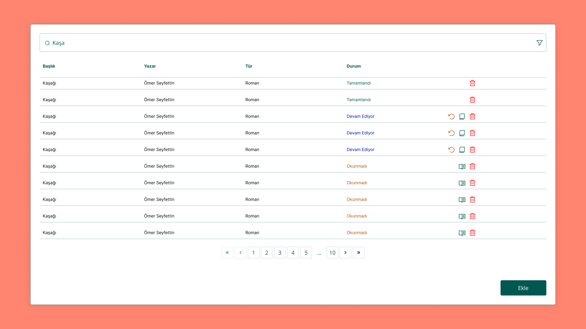
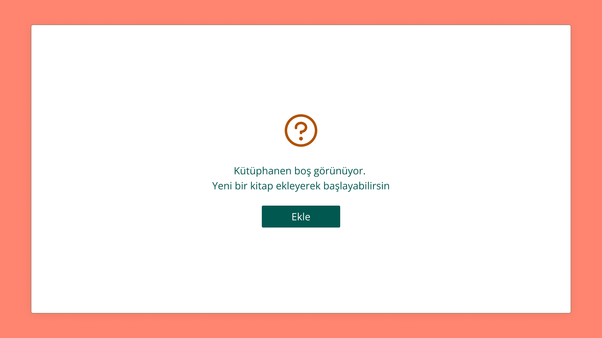

# Librarian

A library app to keep track of the books you are reading

# App

<p align="center"></p>
<p align="center"></p>
<p align="center"></p>
<p align="center"></p>
<p align="center"></p>
<p align="center"></p>

## Usage

### Install Dependencies

```
$ cd librarian

$ npm install
```

### Use it

```
# development mode
$ npm run dev

# production build
$ npm run build
```
